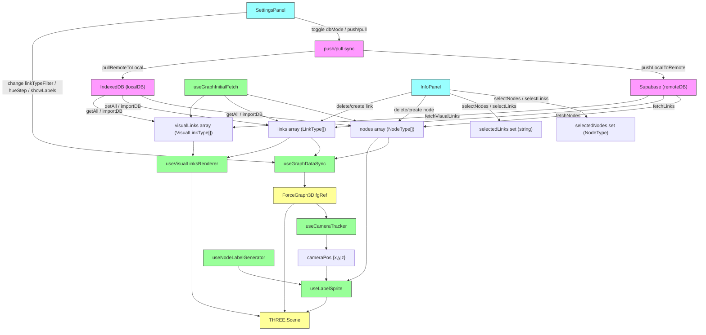

```mermaid
    flowchart TD
        %% =====================
        %% --- Variables clés ---
        %% =====================

        nodes["nodes array (NodeType[])"]
        links["links array (LinkType[])"]
        visualLinks["visualLinks array (VisualLinkType[])"]
        cameraPos["cameraPos {x,y,z}"]
        selectedNodes["selectedNodes set (NodeType)"]
        selectedLinks["selectedLinks set (string)"]

        %% =====================
        %% --- Sources DB ---
        %% =====================
        LocalDB["IndexedDB (localDB)"]
        RemoteDB["Supabase (remoteDB)"]

        %% =====================
        %% --- Hooks & Sync ---
        %% =====================
        GraphFetch["useGraphInitialFetch"] 
        GraphSync["useGraphDataSync"] 
        SyncDB["push/pull sync"]

        CameraTracker["useCameraTracker"] 
        NodeLabelGen["useNodeLabelGenerator"] 
        LabelSprite["useLabelSprite"] 
        VisualLinksRenderer["useVisualLinksRenderer"] 

        %% =====================
        %% --- UI Panels ---
        %% =====================
        SettingsPanel["SettingsPanel"]
        InfoPanel["InfoPanel"]

        %% =====================
        %% --- Three.js Scene ---
        %% =====================
        ForceGraph["ForceGraph3D fgRef"]
        ThreeScene["THREE.Scene"]

        %% =====================
        %% --- Flux des données ---
        %% =====================

        %% --- DB -> React State ---
        LocalDB -->|getAll / importDB| nodes
        LocalDB -->|getAll / importDB| links
        LocalDB -->|getAll / importDB| visualLinks

        RemoteDB -->|fetchNodes| nodes
        RemoteDB -->|fetchLinks| links
        RemoteDB -->|fetchVisualLinks| visualLinks

        SyncDB -->|pushLocalToRemote| RemoteDB
        SyncDB -->|pullRemoteToLocal| LocalDB

        %% --- Initial Fetch ---
        GraphFetch --> nodes
        GraphFetch --> links
        GraphFetch --> visualLinks

        %% --- State Sync ---
        nodes --> GraphSync
        links --> GraphSync
        GraphSync --> ForceGraph
        links --> VisualLinksRenderer
        visualLinks --> VisualLinksRenderer

        %% --- Camera Tracking ---
        ForceGraph --> CameraTracker
        CameraTracker --> cameraPos
        cameraPos --> LabelSprite

        %% --- Node Labels ---
        nodes --> LabelSprite
        NodeLabelGen --> LabelSprite
        LabelSprite --> ThreeScene

        %% --- Visual Links ---
        VisualLinksRenderer --> ThreeScene

        %% --- UI Panels ---
        SettingsPanel -->|toggle dbMode / push/pull| SyncDB
        SettingsPanel -->|change linkTypeFilter / hueStep / showLabels| GraphSync
        InfoPanel -->|selectNodes / selectLinks| selectedNodes
        InfoPanel -->|selectNodes / selectLinks| selectedLinks
        InfoPanel -->|delete/create node| nodes
        InfoPanel -->|delete/create link| links

        %% --- ForceGraph → Three.js ---
        ForceGraph --> ThreeScene

        %% =====================
        %% --- Styles ---
        %% =====================
        classDef db fill:#f9f,stroke:#333,stroke-width:1px;
        classDef react fill:#9f9,stroke:#333,stroke-width:1px;
        classDef three fill:#ff9,stroke:#333,stroke-width:1px;
        classDef ui fill:#9ff,stroke:#333,stroke-width:1px;

        class LocalDB,RemoteDB,SyncDB db;
        class GraphFetch,GraphSync,CameraTracker,NodeLabelGen,LabelSprite,VisualLinksRenderer react;
        class ForceGraph,ThreeScene three;
        class SettingsPanel,InfoPanel ui;
```