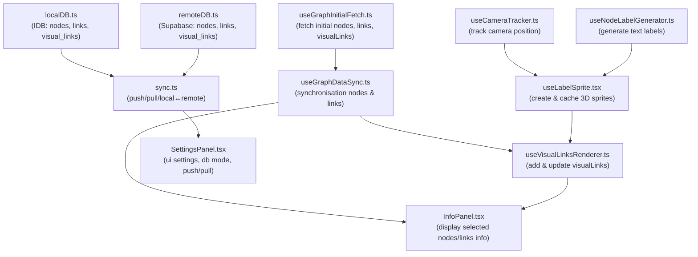

```mermaid
    flowchart TD
        LocalDB["localDB.ts\n(IDB: nodes, links, visual_links)"]
        RemoteDB["remoteDB.ts\n(Supabase: nodes, links, visual_links)"]
        Sync["sync.ts\n(push/pull/local↔remote)"]
        GraphSyncHook["useGraphDataSync.ts\n(synchronisation nodes & links)"]
        GraphFetchHook["useGraphInitialFetch.ts\n(fetch initial nodes, links, visualLinks)"]
        CameraHook["useCameraTracker.ts\n(track camera position)"]
        LabelGeneratorHook["useNodeLabelGenerator.ts\n(generate text labels)"]
        LabelSpriteHook["useLabelSprite.tsx\n(create & cache 3D sprites)"]
        VisualLinksRendererHook["useVisualLinksRenderer.ts\n(add & update visualLinks)"]
        SettingsPanel["SettingsPanel.tsx\n(ui settings, db mode, push/pull)"]
        InfoPanel["InfoPanel.tsx\n(display selected nodes/links info)"]
        
        LocalDB --> Sync
        RemoteDB --> Sync
        Sync --> SettingsPanel
        GraphFetchHook --> GraphSyncHook
        GraphSyncHook --> VisualLinksRendererHook
        GraphSyncHook --> InfoPanel
        CameraHook --> LabelSpriteHook
        LabelGeneratorHook --> LabelSpriteHook
        LabelSpriteHook --> VisualLinksRendererHook
        VisualLinksRendererHook --> InfoPanel
```