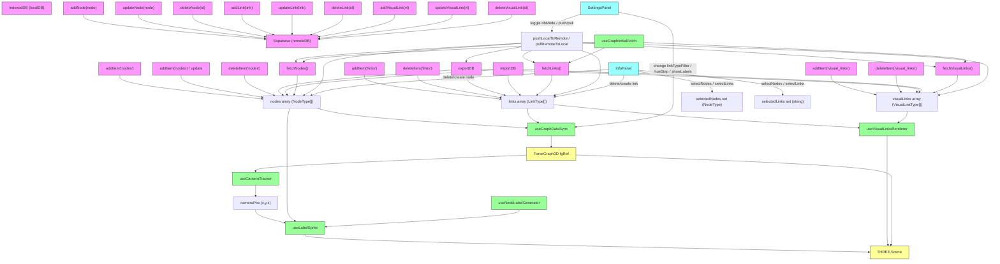

```mermaid
    flowchart TD
        %% =====================
        %% --- Variables clés ---
        %% =====================
        nodes["nodes array (NodeType[])"]
        links["links array (LinkType[])"]
        visualLinks["visualLinks array (VisualLinkType[])"]
        cameraPos["cameraPos {x,y,z}"]
        selectedNodes["selectedNodes set (NodeType)"]
        selectedLinks["selectedLinks set (string)"]

        %% =====================
        %% --- Bases de données ---
        %% =====================
        LocalDB["IndexedDB (localDB)"]
        RemoteDB["Supabase (remoteDB)"]

        %% --- CRUD Local ---
        L_addNode["addItem('nodes')"]
        L_updateNode["addItem('nodes') / update"]
        L_deleteNode["deleteItem('nodes')"]
        L_addLink["addItem('links')"]
        L_deleteLink["deleteItem('links')"]
        L_addVisualLink["addItem('visual_links')"]
        L_deleteVisualLink["deleteItem('visual_links')"]
        L_export["exportDB"]
        L_import["importDB"]

        %% --- CRUD Remote ---
        R_addNode["addNode(node)"]
        R_updateNode["updateNode(node)"]
        R_deleteNode["deleteNode(id)"]
        R_addLink["addLink(link)"]
        R_updateLink["updateLink(link)"]
        R_deleteLink["deleteLink(id)"]
        R_addVisualLink["addVisualLink(vl)"]
        R_updateVisualLink["updateVisualLink(vl)"]
        R_deleteVisualLink["deleteVisualLink(id)"]
        R_fetchNodes["fetchNodes()"]
        R_fetchLinks["fetchLinks()"]
        R_fetchVisualLinks["fetchVisualLinks()"]

        %% =====================
        %% --- Hooks & Sync ---
        %% =====================
        GraphFetch["useGraphInitialFetch"] 
        GraphSync["useGraphDataSync"] 
        SyncDB["pushLocalToRemote / pullRemoteToLocal"]

        CameraTracker["useCameraTracker"] 
        NodeLabelGen["useNodeLabelGenerator"] 
        LabelSprite["useLabelSprite"] 
        VisualLinksRenderer["useVisualLinksRenderer"] 

        %% =====================
        %% --- UI Panels ---
        %% =====================
        SettingsPanel["SettingsPanel"]
        InfoPanel["InfoPanel"]

        %% =====================
        %% --- Three.js Scene ---
        %% =====================
        ForceGraph["ForceGraph3D fgRef"]
        ThreeScene["THREE.Scene"]

        %% =====================
        %% --- Flux détaillé ---
        %% =====================

        %% --- Local DB CRUD ---
        L_addNode --> nodes
        L_updateNode --> nodes
        L_deleteNode --> nodes
        L_addLink --> links
        L_deleteLink --> links
        L_addVisualLink --> visualLinks
        L_deleteVisualLink --> visualLinks
        L_export --> nodes
        L_export --> links
        L_export --> visualLinks
        L_import --> nodes
        L_import --> links
        L_import --> visualLinks

        %% --- Remote DB CRUD ---
        R_fetchNodes --> nodes
        R_fetchLinks --> links
        R_fetchVisualLinks --> visualLinks
        R_addNode --> RemoteDB
        R_updateNode --> RemoteDB
        R_deleteNode --> RemoteDB
        R_addLink --> RemoteDB
        R_updateLink --> RemoteDB
        R_deleteLink --> RemoteDB
        R_addVisualLink --> RemoteDB
        R_updateVisualLink --> RemoteDB
        R_deleteVisualLink --> RemoteDB

        %% --- Sync ---
        SyncDB --> L_export
        SyncDB --> R_fetchNodes
        SyncDB --> R_fetchLinks
        SyncDB --> R_fetchVisualLinks
        SyncDB --> nodes
        SyncDB --> links
        SyncDB --> visualLinks

        %% --- Initial Fetch & State Sync ---
        GraphFetch --> R_fetchNodes
        GraphFetch --> R_fetchLinks
        GraphFetch --> R_fetchVisualLinks
        nodes --> GraphSync
        links --> GraphSync
        GraphSync --> ForceGraph
        links --> VisualLinksRenderer
        visualLinks --> VisualLinksRenderer

        %% --- Camera Tracking ---
        ForceGraph --> CameraTracker
        CameraTracker --> cameraPos
        cameraPos --> LabelSprite

        %% --- Node Labels ---
        nodes --> LabelSprite
        NodeLabelGen --> LabelSprite
        LabelSprite --> ThreeScene

        %% --- Visual Links ---
        VisualLinksRenderer --> ThreeScene

        %% --- UI Panels ---
        SettingsPanel -->|toggle dbMode / push/pull| SyncDB
        SettingsPanel -->|change linkTypeFilter / hueStep / showLabels| GraphSync
        InfoPanel -->|selectNodes / selectLinks| selectedNodes
        InfoPanel -->|selectNodes / selectLinks| selectedLinks
        InfoPanel -->|delete/create node| nodes
        InfoPanel -->|delete/create link| links

        %% --- ForceGraph → Three.js ---
        ForceGraph --> ThreeScene

        %% =====================
        %% --- Styles ---
        %% =====================
        classDef db fill:#f9f,stroke:#333,stroke-width:1px;
        classDef react fill:#9f9,stroke:#333,stroke-width:1px;
        classDef three fill:#ff9,stroke:#333,stroke-width:1px;
        classDef ui fill:#9ff,stroke:#333,stroke-width:1px;

        class LocalDB,RemoteDB,L_addNode,L_updateNode,L_deleteNode,L_addLink,L_deleteLink,L_addVisualLink,L_deleteVisualLink,L_export,L_import,R_addNode,R_updateNode,R_deleteNode,R_addLink,R_updateLink,R_deleteLink,R_addVisualLink,R_updateVisualLink,R_deleteVisualLink,R_fetchNodes,R_fetchLinks,R_fetchVisualLinks db;
        class GraphFetch,GraphSync,CameraTracker,NodeLabelGen,LabelSprite,VisualLinksRenderer react;
        class ForceGraph,ThreeScene three;
        class SettingsPanel,InfoPanel ui;

```